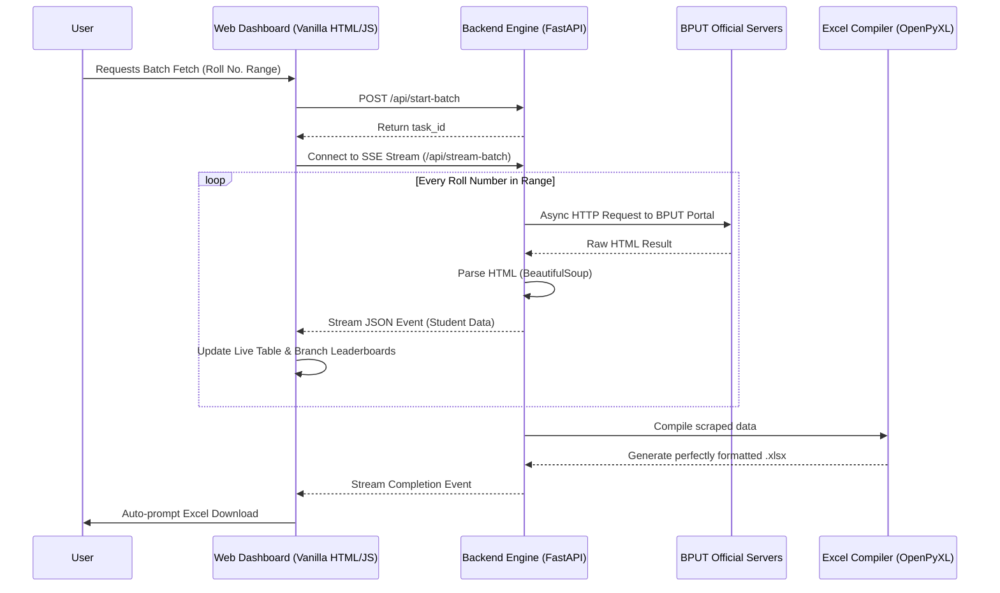

<div align="center">
  <h1>🎓 BPUT Result Scraper & Analytics Dashboard</h1>
  <p><strong>A blazingly fast, real-time result scraping and analytics engine for BPUT University.</strong></p>

  [](https://bput-result.onrender.com/)
  [](https://github.com/srsoumyax11/BPUT_result)
</div>

<br />

## 🚨 The Problem
Every semester, thousands of BPUT students face the tedious task of navigating slow, unoptimized university portals to check their results. 
For class representatives, faculty, and placement coordinators, manually collecting and compiling the academic performance of an entire batch into spreadsheets is a nightmare that takes hours of manual data entry.
Furthermore, the official portal lacks deep analytical insights—making it difficult for students to instantly track their SGPA progression, calculate an estimated CGPA, or quickly spot active backlogs.

## 💡 The Solution
**BPUT Result Scraper** completely automates and modernizes this experience. Built with a high-performance **FastAPI** backend and a sleek, framework-free glassmorphic frontend, it transforms raw university data into actionable, beautifully formatted insights in milliseconds.

Whether you're a student looking for a deep dive into your academic journey, or an administrator needing to compile 100+ student results into a perfectly formatted Excel sheet in under a minute—this tool does it all.

---

## ✨ Features

### 👨‍🎓 For Students (Single Fetch)
- **Deep Analytics:** Instantly calculates an "Estimated CGPA" across all your semesters.
- **Backlog Detection:** Actively scans for `F`/`M` grades and highlights active backlogs so you never miss a requirement.
- **SGPA Progression:** Visualizes your academic journey with beautifully animated graphs.
- **Premium UI:** A stunning, modern, dark-mode dashboard that presents data cleanly.

### 🏫 For Administrators & CRs (Batch Fetch)
- **Real-Time Streaming:** Input a range of Roll Numbers and watch the results stream live to the dashboard via Server-Sent Events (SSE).
- **Branch-Wise Sorting:** Automatically detects and separates students by their engineering branch dynamically.
- **Live Leaderboards:** Calculates and updates a Top 3 Topper Leaderboard for *every individual branch* in real-time as data pours in!
- **Automated Excel Compilation:** Generates beautifully formatted, production-ready `.xlsx` files. The sheets automatically group students by branch, dynamically expand subject columns, and color-code passing/failing grades.

---

## 🏗️ Architecture

The application uses an asynchronous, non-blocking architecture to ensure that even massive batch-fetching requests are handled efficiently without blocking the server.



---

## 🚀 How to Run Locally

Want to run the backend engine yourself? It takes less than 2 minutes to set up.

### Prerequisites
- Python 3.9+
- pip

### Installation

1. **Clone the repository:**
   ```bash
   git clone https://github.com/srsoumyax11/BPUT_result.git
   cd BPUT_result
   ```

2. **Install the dependencies:**
   ```bash
   pip install -r requirements.txt
   ```

3. **Start the FastAPI Server:**
   ```bash
   uvicorn main:app --reload
   ```

4. **Open in Browser:**
   Navigate to `http://localhost:8000` to interact with the dashboard.

---

## 🤝 Contributing & Collaboration

This project is actively maintained and open to collaboration! If you're passionate about Web Scraping, Data Analytics, Python, or Frontend UI/UX, we'd love to have you on board.

**How you can help:**
- **Add Support for More BPUT Results:** Extend the scraping logic to cover M.Tech, MBA, or MCA results.
- **Export to PDF:** Add a feature to download a student's personalized analytics dashboard as a PDF.
- **Code Optimization:** Help us improve the asynchronous fetching speed or reduce memory overhead.

1. Fork the Project
2. Create your Feature Branch (`git checkout -b feature/AmazingFeature`)
3. Commit your Changes (`git commit -m 'Add some AmazingFeature'`)
4. Push to the Branch (`git push origin feature/AmazingFeature`)
5. Open a Pull Request

---

<div align="center">
  <p>Built with ❤️ by <a href="https://github.com/srsoumyax11">srsoumyax11</a>.</p>
  <p>If this project helped you, consider giving it a ⭐ on GitHub!</p>
</div>
