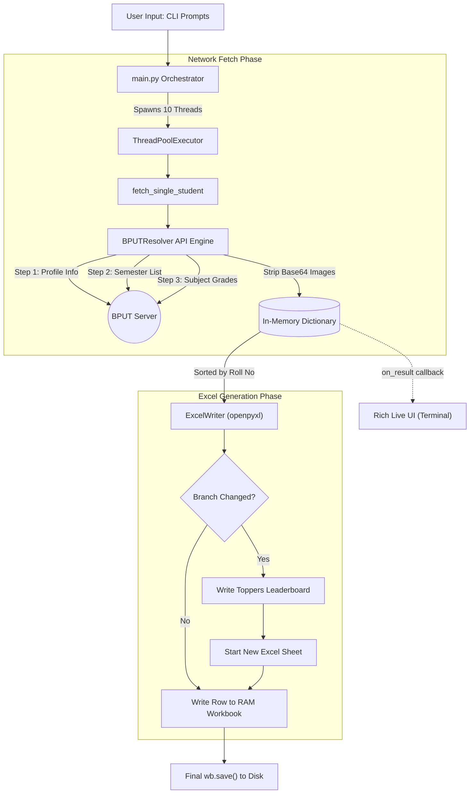

# How the BPUT Result Scraper Works

This document explains the end-to-end flow of the current Python CLI application. Understanding this architecture is crucial before we migrate the core engine into a FastAPI web backend.

## System Architecture Diagram

---

## 1. The Orchestrator (`cli/main.py`)
This is the brain of the application. When you run `python -m cli.main`, it executes a 7-phase process:
1. **Gather Inputs**: Asks the user for start/end roll numbers and session.
2. **Preview**: Fetches the very first student to confirm the session and branch are correct.
3. **Batch Fetch**: Triggers a multi-threaded background process to download the rest of the students.
4. **Live UI**: Renders a live-updating terminal table so the user can watch the progress.
5. **Excel Parsing**: Iterates through the fetched results in numerical order and writes them to Excel.
6. **Branch Detection**: Automatically detects if a student belongs to a new branch, and seamlessly creates a new Excel sheet for them.
7. **Final Save**: Generates the final footers and gracefully exits.

---

## 2. The API Resolver (`api_test/combined_resolver.py`)
This is the networking engine. BPUT's server doesn't give us all the data in one request. For every single student, the resolver performs a 3-step API handshake:
1. **`get_student_info`**: Fetches the student's name, branch, college, and profile picture.
2. **`get_result_list`**: Fetches the list of all semesters the student has taken (e.g., Sem 1, Sem 2, Sem 3).
3. **`get_grades`**: Takes the *most recent* semester from step 2 and fetches the actual grades and SGPA.

> [!TIP]
> **Performance Optimization:** The resolver uses a single `requests.Session()` to pool TCP connections, preventing the operating system from crashing due to socket exhaustion on massive batches.

---

## 3. The Fetcher Engine (`cli/fetcher.py`)
Because downloading hundreds of students sequentially would take forever, the fetcher uses a `ThreadPoolExecutor` to run **10 parallel threads**.
- As soon as a student is downloaded, the fetcher **instantly deletes** the massive base64 profile picture from memory to prevent Out-Of-Memory (OOM) crashes.
- If the BPUT server is overwhelmed and times out, the fetcher uses **Exponential Backoff** (waiting 1s, then 2s, then 4s) before retrying.
- It maintains an internal thread-safe dictionary (`all_results`) and fires an `on_result` callback to the UI the moment a student completes.

---

## 4. The Terminal UI (`cli/display.py` & `cli/prompts.py`)
Built using the `rich` library, this handles all user interactions.
- **Auto-Session:** `prompts.py` calculates the current date and automatically suggests the correct Odd/Even session name so you can just press Enter.
- **Sliding Live Table:** While the batch fetch is running, a `rich.live.Live` table updates 4 times a second. To prevent CPU lag, it acts as an "activity feed", dropping old rows and only ever rendering the **last 5 students** fetched.

---

## 5. The Excel Generator (`cli/excel_writer.py`)
This script takes the messy JSON data and builds the beautiful spreadsheet using `openpyxl`.
- **Dynamic Headers:** It doesn't know the subjects beforehand. As it reads each student, if it sees a new Subject Code, it dynamically expands the table headers to fit it.
- **Auto-Save:** It writes to the hard drive every 10 students so data isn't lost during a crash.
- **Branch Splits:** If it detects a student from CIVIL and the next is MECHANICAL, it automatically seals the CIVIL sheet, writes the footer, and opens a new MECHANICAL sheet.
- **The Footer & Leaderboard:** When a branch is finished, it scans all the SGPAs in that specific section, ranks them, and writes a **Top 6 Toppers Leaderboard** at the bottom-right of the sheet, beautifully color-coded (Green for >8.0, Yellow for >6.0).
